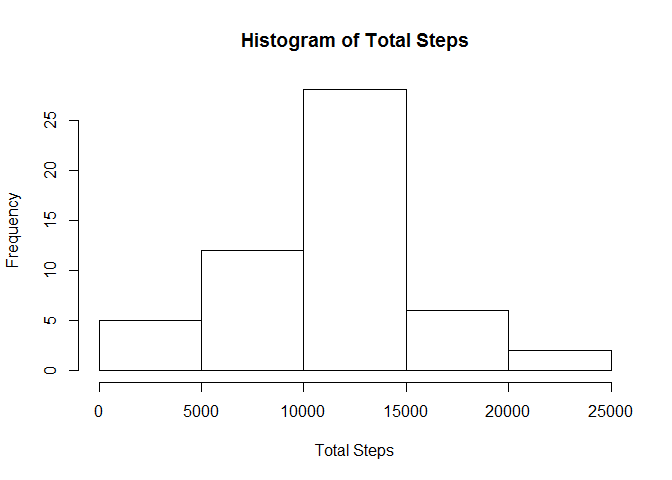
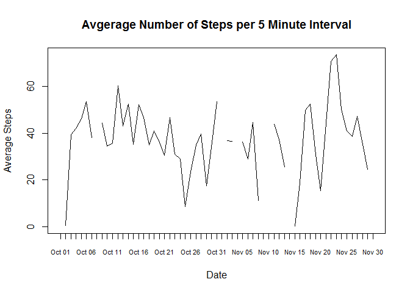
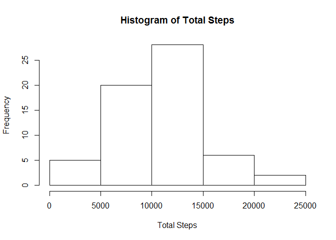
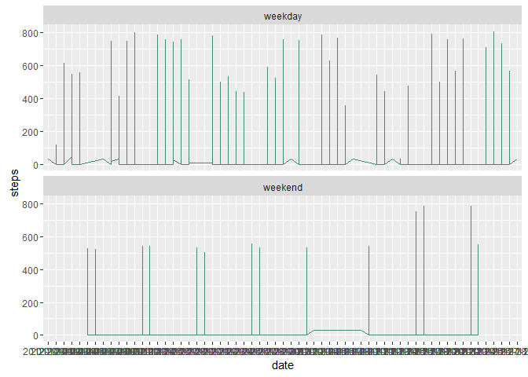

# Reproducible Research: Peer Assessment 1


## Loading and preprocessing the data

Libraries used: dplyr, ggplot2


Data was loded into a single dataframe named "df"

```r
df <- read.csv("activity.csv")
str(df)
```

```
## 'data.frame':	17568 obs. of  3 variables:
##  $ steps   : int  NA NA NA NA NA NA NA NA NA NA ...
##  $ date    : Factor w/ 61 levels "2012-10-01","2012-10-02",..: 1 1 1 1 1 1 1 1 1 1 ...
##  $ interval: int  0 5 10 15 20 25 30 35 40 45 ...
```

## What is mean total number of steps taken per day?
Create a vector of all dates present in the dataframe

```r
Dates <- as.Date(strftime(df$date, "%Y-%m-%d"))
allDates <- seq(from = min(Dates), to = max(Dates), by = "day")
str(allDates)
```

```
##  Date[1:61], format: "2012-10-01" "2012-10-02" "2012-10-03" "2012-10-04" ...
```

Use sapply to get a count of steps for each day in the date vector and then 
add them to new data frame


```r
step.count <- sapply(allDates, FUN = function(X) sum(df$steps[Dates == X]))
totals <- data.frame(day = allDates, total_steps = step.count)
str(totals)
```

```
## 'data.frame':	61 obs. of  2 variables:
##  $ day        : Date, format: "2012-10-01" "2012-10-02" ...
##  $ total_steps: int  NA 126 11352 12116 13294 15420 11015 NA 12811 9900 ...
```
Use the base plotting system to create a histogram (quantiles)

```r
hist(totals$total_steps, breaks=5, xlab="Total Steps", main="Histogram of Total Steps")
```



Calculate the mean and median of the total steps taken per day and print them to screen

```r
step_mean <- mean(totals$total_steps, na.rm = TRUE)
print(paste(c("Average number of steps per day", step_mean), collapse = " : "))
```

```
## [1] "Average number of steps per day : 10766.1886792453"
```

```r
step_median <- median(totals$total_steps, na.rm = TRUE)
print(paste(c("Median number of steps per day", step_median), collapse = " : "))
```

```
## [1] "Median number of steps per day : 10765"
```

## What is the average daily activity pattern?
Calculate the average number of steps per 5 minutes for each day and place into a data frame

```r
average_steps <- sapply(allDates, FUN = function(X) mean(df$steps[Dates == X]))
average_totals <- data.frame(day = allDates, avg_steps = average_steps)
str(average_totals)
```

```
## 'data.frame':	61 obs. of  2 variables:
##  $ day      : Date, format: "2012-10-01" "2012-10-02" ...
##  $ avg_steps: num  NA 0.438 39.417 42.069 46.16 ...
```

Create a line plot of the average number of steps taken per five minutes by day


```r
plot(average_totals$avg_steps ~ average_totals$day, average_totals, xaxt = "n", type = "l", xlab="Date", ylab="Average Steps", main = "Avgerage Number of Steps per 5 Minute Interval")
axis(1, average_totals$day, format(average_totals$day, "%b %d"), cex.axis = .7)
```



## Inputing missing values
Report on the total number of missing records

```r
total_nas <- sum(is.na(df$steps))
print(paste(c("Total number of missing values", total_nas), collapse = " : "))
```

```
## [1] "Total number of missing values : 2304"
```

Calculate the average number of steps per 5 minute interval

```r
avg_steps <- sum(df$steps, na.rm = TRUE)/nrow(df)
print(paste(c("Average number of steps per 5 minute interval", avg_steps), collapse = " : "))
```

```
## [1] "Average number of steps per 5 minute interval : 32.4799635701275"
```

Replace NA values with the average number of steps

```r
df$steps[is.na(df$steps)] <- avg_steps
total_nas <- sum(is.na(df$steps))
print(paste(c("Total number of missing values", total_nas), collapse = " : "))
```

```
## [1] "Total number of missing values : 0"
```

```r
str(df)
```

```
## 'data.frame':	17568 obs. of  3 variables:
##  $ steps   : num  32.5 32.5 32.5 32.5 32.5 ...
##  $ date    : Factor w/ 61 levels "2012-10-01","2012-10-02",..: 1 1 1 1 1 1 1 1 1 1 ...
##  $ interval: int  0 5 10 15 20 25 30 35 40 45 ...
```

### Replot the histogram after missing values have been replaced

Recalculate the daily total

```r
step.count <- sapply(allDates, FUN = function(X) sum(df$steps[Dates == X]))
totals <- data.frame(day = allDates, total_steps = step.count)
```

Use the base plotting system to create a histogram (quantiles)

```r
hist(totals$total_steps, breaks=5, xlab="Total Steps", main="Histogram of Total Steps")
```



Calculate the mean and median of the total steps taken per day and print them to screen

```r
step_mean <- mean(totals$total_steps, na.rm = TRUE)
print(paste(c("Average number of steps per day", step_mean), collapse = " : "))
```

```
## [1] "Average number of steps per day : 10581.013705993"
```

```r
step_median <- median(totals$total_steps, na.rm = TRUE)
print(paste(c("Median number of steps per day", step_median), collapse = " : "))
```

```
## [1] "Median number of steps per day : 10395"
```
## Are there differences in activity patterns between weekdays and weekends?

Get a list of dates and their correcponding day of the week

```r
wd <- weekdays(as.Date(df$date))
str(wd)
```

```
##  chr [1:17568] "Monday" "Monday" "Monday" "Monday" "Monday" ...
```

Create a weekday/weekend vector

```r
ww <- sapply(wd, function(x){if(x == "Saturday" || x == "Sunday") "weekend" else "weekday"})
str(ww)
```

```
##  Named chr [1:17568] "weekday" "weekday" "weekday" "weekday" ...
##  - attr(*, "names")= chr [1:17568] "Monday" "Monday" "Monday" "Monday" ...
```

Bind it to the dataframe

```r
df <- mutate(df, day_type = ww)
str(df)
```

```
## 'data.frame':	17568 obs. of  4 variables:
##  $ steps   : num  32.5 32.5 32.5 32.5 32.5 ...
##  $ date    : Factor w/ 61 levels "2012-10-01","2012-10-02",..: 1 1 1 1 1 1 1 1 1 1 ...
##  $ interval: int  0 5 10 15 20 25 30 35 40 45 ...
##  $ day_type: Named chr  "weekday" "weekday" "weekday" "weekday" ...
##   ..- attr(*, "names")= chr  "Monday" "Monday" "Monday" "Monday" ...
```


Create a panel plot using ggplot

```r
p <- ggplot(df, aes(x=date, y=steps, group=1))+geom_line(color="aquamarine4")+facet_wrap(~day_type, nrow=2)
print(p)
```


